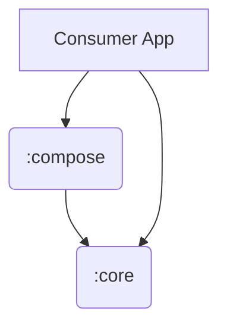

# Arquitetura da API

Este documento descreve a estrutura técnica e a organização de módulos da Response API.

## 1. Estrutura Multi-modular

A biblioteca é dividida em módulos para garantir portabilidade e performance.

### :core (Pure Kotlin)
- **Natureza:** JVM/Kotlin Library.
- **Responsabilidades:** Definição da sealed class `Response`, lógica de estados, operadores de Flow.
- **Dependências:** `kotlinx-coroutines-core`.
- **Restrição:** Proibido o uso de `android.*` ou dependências de UI.

### :compose (UI Integration)
- **Natureza:** Android/Compose Library.
- **Responsabilidades:** Composables, utilitários para o ciclo de vida do Compose, estabilidade de tipos.
- **Dependências:** `:core`, `androidx.compose.runtime`, `kotlinx-coroutines-android`.

## 2. Decisões de Design Chave

### Estabilidade do Compose
Utilizamos um arquivo de configuração de estabilidade (`compose-stability.conf`) no módulo `:compose` para informar ao compilador que as classes do módulo `:core` (que não conhece o Compose) são estáveis. Isso evita recomposições desnecessárias na UI.

### Gestão de Dependências
Utilizamos o **Gradle Version Catalog** (`libs.versions.toml`) para centralizar as versões das bibliotecas, garantindo que todos os módulos utilizem a mesma versão de Coroutines e Compose.

### Separação de Pacotes
Os pacotes seguem a estrutura do módulo para evitar o problema de "Split Packages":
- `br.com.arml.response.core.*`
- `br.com.arml.response.compose.*`

## 3. Publicação
A API é preparada para ser publicada no **GitHub Packages**. A configuração de publicação é centralizada no `build.gradle.kts` raiz através do bloco `subprojects`, facilitando a adição de novos módulos no futuro.
