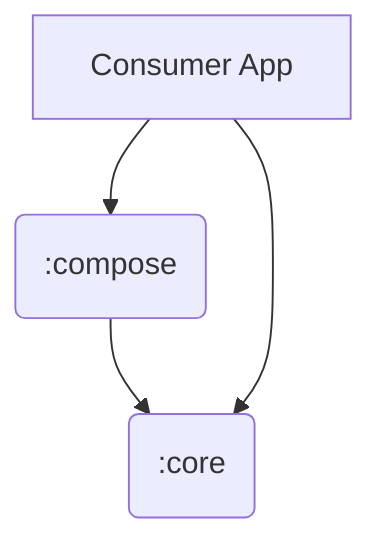

# Arquitetura da API

Este documento descreve a estrutura técnica e a organização de módulos da Response API.

## 1. Estrutura Multi-modular

A biblioteca é dividida em módulos para garantir portabilidade e performance.

### :core (Pure Kotlin)
- **Natureza:** JVM/Kotlin Library.
- **Responsabilidades:** Motor de estados resilientes, lógica de `State Recovery`, operadores funcionais.
- **Dependências:** `kotlinx-coroutines-core`.
- **Restrição:** Proibido o uso de `android.*` ou dependências de UI.

### :compose (UI Integration)
- **Natureza:** Android/Compose Library.
- **Responsabilidades:** Componentes inteligentes que reagem à resiliência do Core, estabilidade de tipos para o compilador do Compose.
- **Dependências:** `:core`, `androidx.compose.runtime`, `kotlinx-coroutines-android`.

## 2. Decisões de Design Chave

### State Recovery Engine
O coração da API é a capacidade de reter o último sucesso conhecido. Isso é implementado no `:core` e propagado automaticamente através da extensão `.withCache()`. 

### Semantic Error Mapping
Utilizamos a interface `ErrorReason` para desacoplar a UI de implementações de rede ou persistência. Isso permite que a biblioteca seja usada em qualquer contexto (Mobile, Desktop, Server) mantendo a mesma semântica de erro.

### Pluggable Policy Architecture
O sistema de metadados foi desenhado seguindo o padrão de **Composição sobre Herança**. Através da interface `ResponsePolicy`, desenvolvedores podem anexar múltiplas estratégias simultâneas ao envelope de metadados, como `PagePaginationPolicy` e `SyncPolicy`. Isso garante que a biblioteca seja agnóstica em relação à estratégia de dados do servidor.

### Performance e Estabilidade
Utilizamos o arquivo `compose-stability.conf` no módulo `:compose` para marcar as classes do `:core` como `@Stable`. Isso garante que o Jetpack Compose consiga pular recomposições quando o estado da `Response` não for alterado, mesmo sendo classes de um módulo puramente JVM.

## 3. Gestão de Erros
A biblioteca padroniza o uso de `Throwable`. Isso garante que erros de infraestrutura e exceções de negócio sejam tratados com o mesmo nível de rigor e facilitem o debug através da causa raiz preservada no estado `Failure`.
